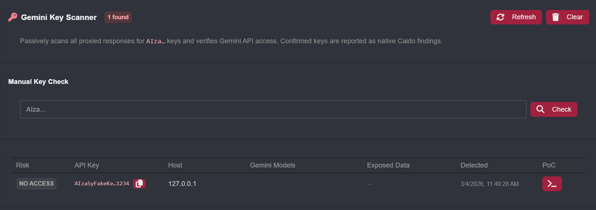

# Caido Plugin: Gemini-Key-Scanner

A [Caido](https://caido.io) plugin that passively detects Google API keys (`AIza…`) in proxied HTTP responses and automatically verifies whether they have live Gemini API access.

## What it does

- **Passive scan** — hooks every intercepted response and extracts `AIza[0-9A-Za-z_-]{35}` patterns
- **Verifies Gemini access** — probes `generativelanguage.googleapis.com/v1beta/models` and classifies each key:

| Status | Meaning |
|--------|---------|
| `HIGH` | Key has active Gemini access with accessible models |
| `MED` | Gemini API responds 200 but no models listed |
| `NO ACCESS` | Key exists but has no Gemini permission (4xx) |
| `ERROR` | Network failure during verification |

- **Enumerates exposed data** — for accessible keys, also probes `/v1beta/files` and `/v1beta/cachedContents` to surface uploaded files and cached context
- **Native Caido findings** — creates a finding with full description and remediation advice
- **Manual check** — paste any key into the UI to verify it on demand

## Background

Google API keys (`AIza…`) were historically safe to embed in client-side code (Maps, Firebase, etc). When the Gemini API is enabled on the same GCP project, those same public keys silently gain access to private Gemini endpoints, including uploaded files, cached data, and billable model usage. See [TruffleHog's research](https://trufflesecurity.com/blog/google-api-keys-werent-secrets-but-then-gemini-changed-the-rules) for full details.

## Install

1. Build: `pnpm install && pnpm build` in this directory
2. In Caido: **Plugins → Install from file** → select the generated `.zip`

3. ## Credits

Thanks to [njcve](https://github.com/njcve) whose Burp Suite extension [gkey-burp](https://github.com/njcve/gkey-burp) was the inspiration for this Caido port.

## License

MIT
